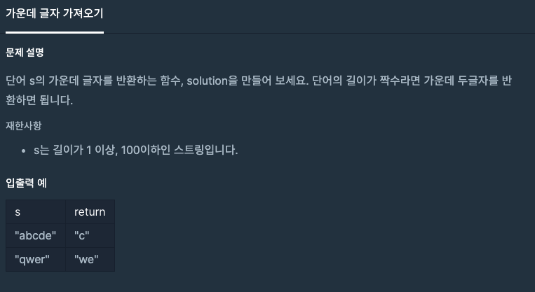

## 가운데 글자 가져오기

#### 1. 문제 설명


#### 2. 코드 설명
```java
class Solution {
    public String solution(String s) {
        /**
        /* 문자열 s의 길이, s의 길이의 2를 나눈값을 구한다.
        /* if(문자열길이 짝수) s의절반길이 - 1 ~ s의절반길이 + 1 만큼에 범위의 문자열을 반환한다.
        /* if(문자열길이 홀수) s의절반길이 - 1 ~ s의절반길이 만큼에 범위의 문자열을 반환한다.
        */
        int sLength = s.length();
        int sHalfIdx = sLength / 2;
        return sLength % 2 == 0 ? s.substring(sHalfIdx - 1, sHalfIdx + 1) : s.substring(sHalfIdx, sHalfIdx + 1);
    }
}
```
#### 상세 설명
- **`s.length()`**: `s`라는 문자열의 길이를 구한다.
- **`int sHalfIdx = sLength / 2;`**: `s`라는 문자열의 전체길이의 절반

- **`String.substring(int a, int b)`** : 문자열을 인덱스 **a이상 b미만 범위**로 잘라온다.  
ex) `"asdf".substring(0, 2) // as를 가져온다.`
- **`return sLength % 2 == 0 ? s.substring(sHalfIdx - 1, sHalfIdx + 1) : s.substring(sHalfIdx, sHalfIdx + 1);`**   
   
  (s의 길이의 % 2) 로 나머지를 구하여 짝수이면 0, 홀수이면 1을 계산한다. 
    
  - **문자열의 길이가 짝수일 경우  `s.substring(sHalfIdx - 1, sHalfIdx + 1)`**  
    `s`를 인덱스 기준 `sHalfIdx` - 1 이상 `sHalfIdx + 1` 미만 으로 잘라 길이가2인 문자열을 리턴한다.

  - **문자열의 길이가 홀수일 경우 `s.substring(sHalfIdx, sHalfIdx + 1)`**  
    `s`를 인덱스 기준 `sHalfIdx` 이상 `sHalfIdx + 1` 미만 으로 잘라 길이가 1인 문자열을 리턴한다.
    