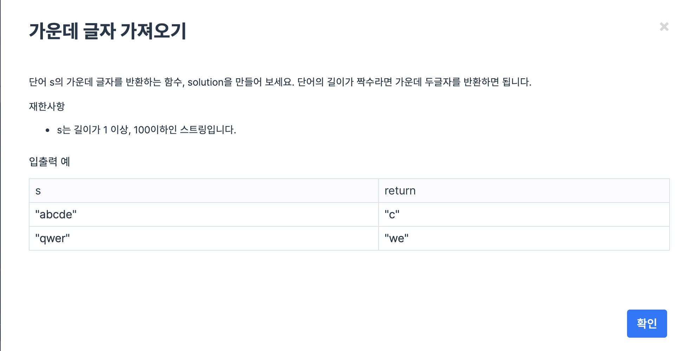

## 가운데 글자 찾아오기

* 문제설명


* 코드 설명

```python
def solution(arr):
    value = list(arr)  # 리스트화 시키기

    # 만약 value의 배열의 크기가 짝수로 떨어지면 중간 값을 2개 리턴시킨다
    if len(value)%2 == 0:
        return ...     

    # 만양 홀수로 떨어지면 중간 값 1개를 리턴시킨다.
    else :
        return ...     
```

* 정석코드

