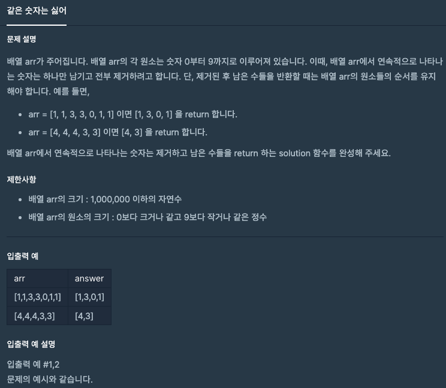

## 같은 숫자는 싫어
#### 1. 문제 설명


#### 2. 코드 설명
```java
import java.util.ArrayList;
import java.util.Arrays;
public class Solution {
    public ArrayList<Integer> solution(int []arr) {
        // 리턴할 값이 일정하지 않으므로 answer로 동적배열을 선언한다.
        ArrayList<Integer> answer = new ArrayList<>();

        int duplicationNum = 18; // 원소는 10 이하의 수가 나오므로 임의의 수를 지정
        // i와 duplicationNum이 중복되지 않으면 answer에 i를 add한다.
        for(int i : arr){
            if(i != duplicationNum){
                answer.add(i);
                duplicationNum = i;
            }
        }
        return answer;
    }
}
```
#### 3. 상세 설명
- `ArrayList<Integer>`: `Integer`타입의 동적 배열을 생성한다. (제네릭은 객체를 받을 수 밖에 없으므로 박싱타입을 넣어준다.)
- `answer.add(i)`: `ArrayList<Integer>` 타입의 `answer`에 i를 추가한다.