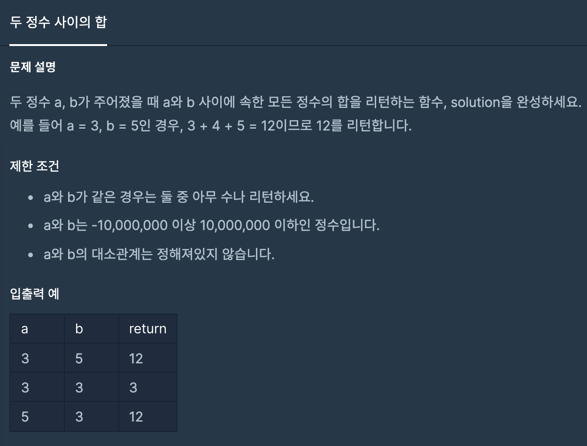

## 두 정수 사이의 합
#### 1. 문제 설명


#### 2. 코드 설명
```java
class Solution {
    // 등차수열 의 합 공식사용 (가우스 공식)
    public long solution(int a, int b) {
        return gaussianFormula(Math.min(a, b), Math.max(b, a));
    }
    private long gaussianFormula(long a, long b) {
        return (b - a + 1) * (a + b) / 2;
    }
}
```