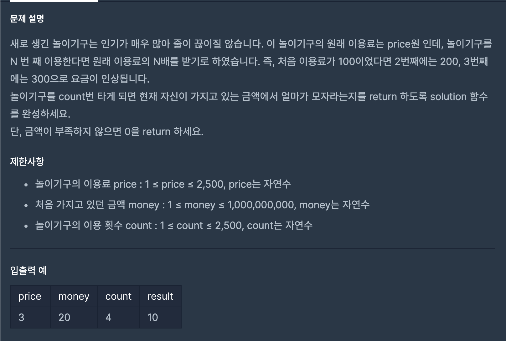

- 문제
  

- 코드설명

```js
function solution(price, money, count) {
  // 1. 이용료 합계를 저장해줄 변수 sum 선언
  // 2. for 문을 통해 count번의 이용료 구하기
  // 3. 삼항연산자를 이용해 돈이 부족하다면 부족한 금액을 반환, 그렇지 않다면 0을 반환

  let sum = 0;

  for (let i = 1; i <= count; i++) sum += price * i;

  return money < sum ? sum - money : 0;
}
```

- 인상 깊은 다른 사람의 풀이

```js
function solution(price, money, count) {
  const tmp = (price * count * (count + 1)) / 2 - money;

  return tmp > 0 ? tmp : 0;
}
```

- 가우스 공식을 사용하여 부족한 금액을 구했다... ~~미친놈이신 것 같다.~~
