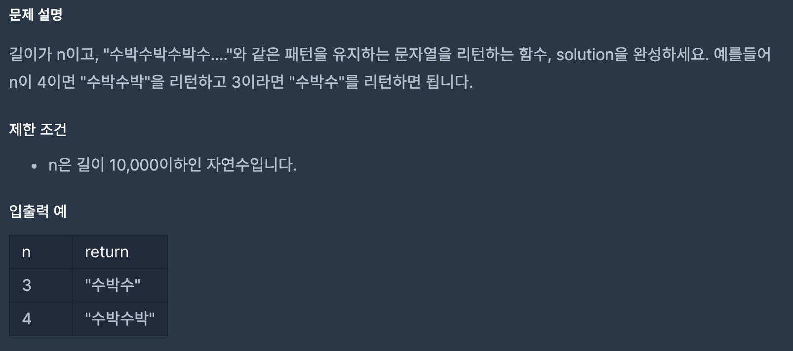

* 문제

  
* 코드설명
```java
class Solution {
    public String solution(int n) {
        // 1. StringBuilder클래스 선언
        // 2. 삼항연산자 사용하여 문자열 추가 
        // 3. toString으로 반환
        
        StringBuilder answer = new StringBuilder();
        for (int i = 1; i <= n; i++) {
            answer.append(i%2==0?"박":"수");
        }
        return answer.toString();
    }
}
```

* 상세설명  
`append()` : 문자열 추가   
  `삼항연산자 이용` : i가 홀수라면 "수", 짝수라면 "박"   
`toString()` : 객체의 정보를 출력
