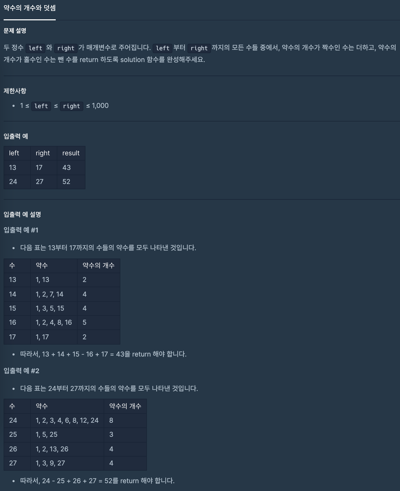

## 약수의 개수와 덧셈
### 1. 문제 설명


### 2. 코드 설명
```java
class Solution {
    
    // 약수의 개수를 구한다/
    int countMeasure(int num){
        int halfOfNum = num / 2; // num의 약수의 범위는 num / 2 이하이다.
        int countMeasure = 1; // 초기값이 1인이유: num의 약수중에 1도 약수이다.
        for(int i = 1; i <= halfOfNum; i++)
            if(num % i == 0) countMeasure++;
        
        return countMeasure;
    }
    
    public int solution(int left, int right) {
        int answer = 0;
        for(;left <= right; left++) // left 부터 right 까지 짝수의 개수를 구한 후 더할지 뺼지 정한다.
            answer += countMeasure(left) % 2 == 0 ? left : left * -1; // left약수의 개수가 짝수이면 left 홀수이면 -left
        
        return answer;
    }
}
```
