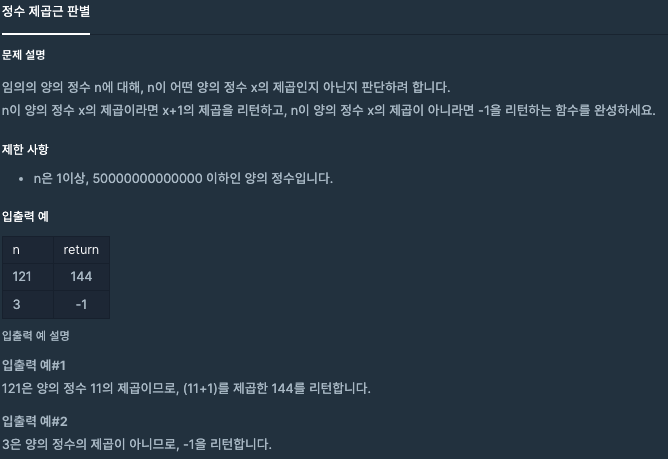

## 정수 제곱근 판별
#### 1. 문제 설명


#### 2. 코드 설명
```java
class Solution {
    public long solution(long n) {
		long sqrt = (long)(Math.sqrt(n)); // 제곱근을 long으로 형변환한다 double -> long
		return sqrt * sqrt == n ? (long)(++sqrt * sqrt) : -1; // 구한 제곱근을 다시 제곱하여 n과 같은지 판별한다. 
    //(정수가 아닌 제곱근은 근사값을 반환한다. 이 근사값을 다시 곱하면 원래 수와 다른수가 되는 원리)
    }
}
```