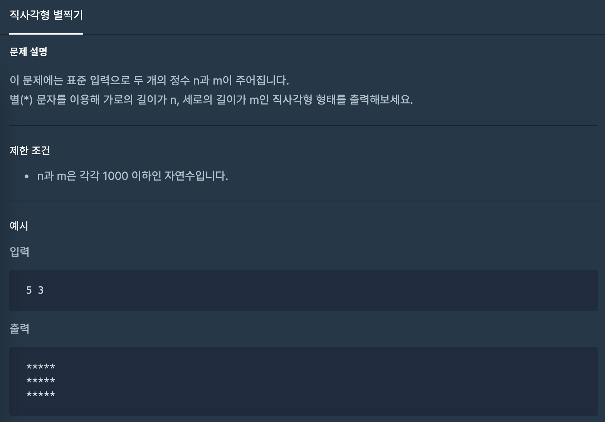

## 직사각형 별찍기
#### 1. 문제 설명


#### 2. 코드 설명
```java
import java.util.Scanner;

public class Solution {
    public static void main(String[] args) {
        Scanner sc = new Scanner(System.in); // 표준 입력 객체 생성
        int a = sc.nextInt(), b = sc.nextInt(); // 두 변수 a, b에 int형의 값을 받아옴

        String oneLineOfAnswer = String.valueOf(new char[a]).replaceAll("\0", "*") + "\n"; // 정답의 첫번째 줄을 구한다.
        StringBuilder answer = new StringBuilder(oneLineOfAnswer);  // 정답의 첫번쨰 줄을 b만큼 더해야 되므로 oneLineOfAnswer의 값을 복사한 변수를 만든다.
        for(int i = 0; i < b - 1; i++)
            answer.append(oneLineOfAnswer); // b - 1만큼 oneLineOfAnswer를 더한다(이미 한개의 줄은 저장되어 있으므로)

        System.out.println(answer);
    }
}
```

#### 3. 세부 설명
1. `String.valueOf(new char[a])`  
   : `char[a]`만큼 만들어진 배열을 String타입으로 반환한다.
2. `replaceAll("\0", "*")` 문자열의 특정문자의 두번쨰 인수로 바꾼다.
3. `String oneLineOfAnswer = String.valueOf(new char[a]).replaceAll("\0", "*") + "\n";`  
4. `\0`은 아스키 코드로 `null`을 의미한다.